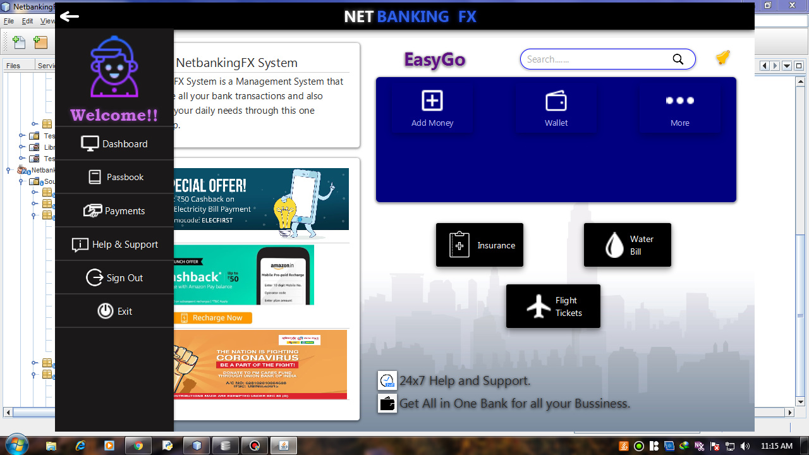
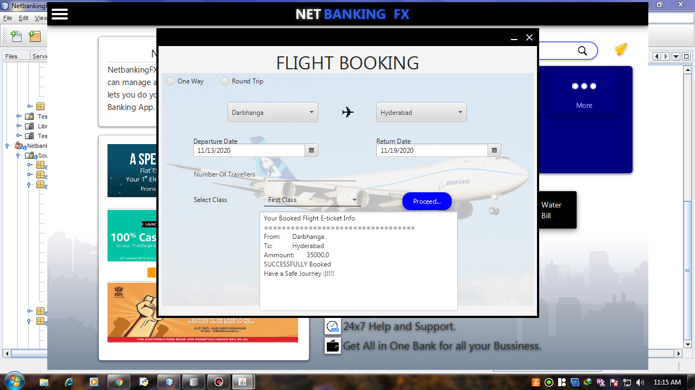
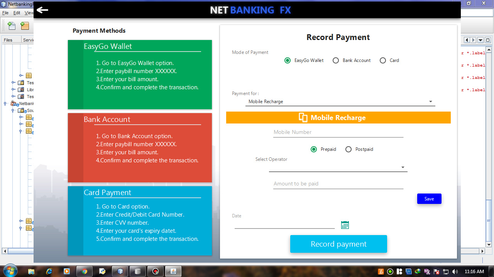
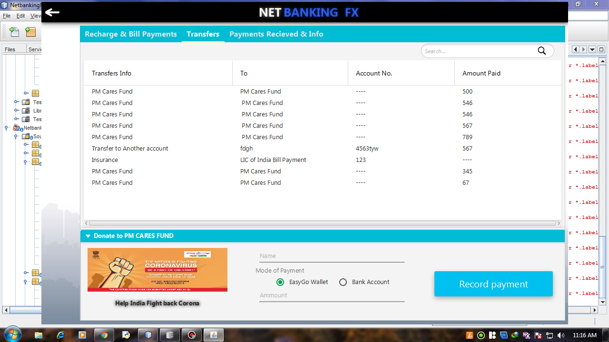

# Netbanking Application 
  An desktop appliaction prototype of an actual netbanking application. 
  The applications can perform all sorts of functions that an netbanking app should have.
  
## Overview
   1.We can implement most of the features of the online banking in it.
   
   2.User can login to the system, do withdrawl, transfer amount from his/her account to another's account, check his/her current balance.
   
   3.Apart from usual banking applications the system is also abale to pay bills, do recharge and many such things like book flight tickets.
   
   4.The system keeps record of the transfers done by the user.
   
 ## Screenshots
 
 ### SignUp and Login Page
  
  
  
   
   
### Dashboard
  
  
  
  
  
### Payments
  
  
  
  
  
### Passbook
  
  
  
  
### About us
  
  
## Funtions

### User Login
    1.SignUP their account. Then Login. 
    2.Can see his/her acc details, pay bills, do recharge, book air tickets, check his passbook.
    
### Passbook page
    1.Lets see your all recorded payments. 
    2.Can print reciept.
   
### Payments Page
    1.Contains setup for all types of payments. 
    
   
## HOW TO RUN THIS PROJECT
   1.Make sure you have Java installet in your pc(dont forget to set path) 
   2.Install Netbeans 8.2 IDE in your pc. 
   3.Download this project Zip folder and extract it. 
   4.Open this project in your Netbeans IDE. 
   5.And Boom yo are ready to go , run this project :)  
   
   
## Disclaimer
   This project is developed for demo purpose and it's not supposed to be used in real Application.
   
   
## Feedback
   Any suggestions and feedback is welcome.you can message me on Linkedin. 
   [MOHIT-linkedin](https://www.linkedin.com/in/mohit-singh-bb50a81a5/) 
   [SARVESH-linkedin](https://www.linkedin.com/in/sarvesh-kale-60b9961b7) 
   [AVDHOOT-linkedin](https://www.linkedin.com/in/avdhoot-jadhav-349a80185) 
## Contribute
   Contributions are always welcome!
    
