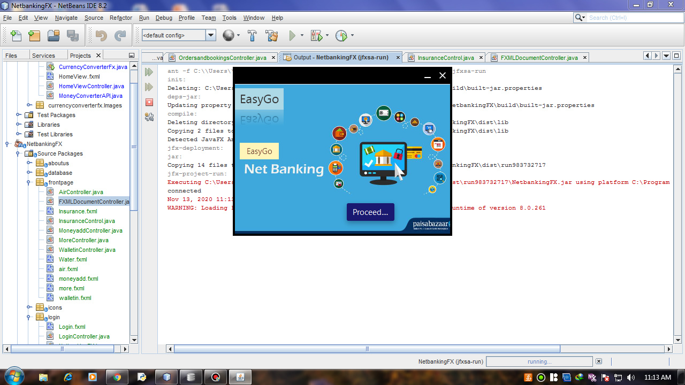

# Netbanking Application 
  An desktop appliaction prototype of an actual netbanking application.
  The applications can perform all sorts of functions that an netbanking app should have.
  
## Overview
   1.We can implement most of the features of the online banking in it.
   
   2.User can login to the system, do withdrawl, transfer amount from his/her account to another's account, check his/her current balance.
   
   3.Apart from usual banking applications the system is also abale to pay bills, do recharge and many such things like book flight tickets.
   
   4.The system keeps record of the transfers done by the user.
   
 ## Screenshots
 
 ### SignUp and Login Page
     
